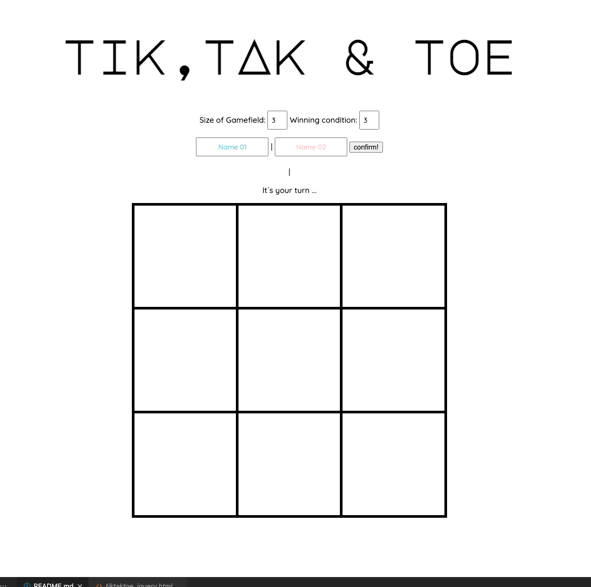

# Semester-Projekt: TikTakToe

Der Klassiker unter den Beschäftigungen die man auf einer langweiligen Familienfeier mal schnell auf der Servierte spielen kann: TikTakToe. Tic-Tac-Toe oder Drei gewinnt ist ein klassisches, einfaches Zweipersonen-Strategiespiel, dessen Geschichte sich bis ins 12. Jahrhundert v. Chr. zurückverfolgen lässt. Und genau weil es so einfach und simpel ist, sollte man es eigentlich immer bei sich haben. Gerade digital, um auch dann, wenn man gerade keine Servierte und Stift zur Hand hat, trotzdem auf dem Laptop diesen Klassiker der Spielekultur spielen zu können. Dies nahm ich als Anlass und programmierte den Klassiker zur Digitalen Variante um. Und falls du den Klassiker variabel erweitern willst, gibt es auch ein paar modifizierungen! 


> ```Dogs playing Poker, but thinking about TikTakToe!```

## Benutzung

Um das TikTakToe spielen zu können muss man zuerst folgende Datein aus meinem Repository clonen: tiktaktoe_jquery.html, tiktaktoe.css und tiktaktoe_jquery.js.

Ist dieser Schritt getan kann es auch schon los gehen. Öffne die Datein tiktaktoe_query.html in deinem Browser (programmiert in Opera), wähle die gewünschte Spielfeldgröße aus (maximal 10*10), confirm die Namen der Spieler und den Rest erledigt das Programm für dich! 

Du hast die Möglichkeit die Spielfeldgröße, Gewinnbedingung (Wie viele Kästchen eines Spielers müssen aneinader gereiht sein) und die Spielnamen individuell an deine Bedürfnisse anzupassen.

Wenn es einen Gewinner gibt, wird das vom Programm erkannt und es wird automatisch eine neue Runde gestartet. Der Spielstand wird unter dem Namensfeldern hochgezählt.

Falls dir das Spiel so zu langweilig wird, kannst du jederzeit die Spielfeldgröße oder die Gewinnbedingung ändern. Falls du während einem Spiel Die Spielfeldgröße änderst wird das aktuelle Spiel neu gestartet und es beginnt alles wieder von vorne. die Gewinnnbedingung kannst du jedoch jederzeit ändern und so auch noch während einem laufendem Spiel die Spannung steigern. Der Spielstand bleibt immer bestehen, außer du lädst die Seite neu. 



## Aufbau

Ich hoffe ich konnte das hier mehr oder weniger verständlich erklären, fiel mir nähmlich garnicht so einfach Computersprache in humane Worte umzuwandeln. 

* **Wichtige Variablen im Code:** 
  * `pointsname`: Hält den Spielstand in Form eines Werts fest.
  * `playerOne/playerTwo`: Um die Spieler/Person im Code abzubilden welche gegeneinander spielen.
  * `aktuellerSpieler`: Der Name sagt alles! Beinhaltet den Spieler, welcher gerade am Zug ist.
  * `size`: Beinhaltet die Spielfeldgröße, welche von den Spielern angegebn wird.
  * `id`: Um jedem Spielfeld eine ID zuzuordnen und es so erkenntlich zumachen.
  * `fieldArray`: Beinhaltet den aktuellen Spielfeld-Status in Form eines Arrays.
  * `pointsToWin`: Der hier angegeben Wert bestimmt wie viele Felder nebeneinader ausgefüllt sein müssen um zu gewinnen.

# Zentrale Funktionen

`sizeOfField()`: Eine Funktion die das TikTakToe Spielfeld auf der HTML-Seite, sowie ein Array, welche Das Spielfeld im Code abbildet, kreiert. 

Die Funktion nimmt den Wert der angebenen Spielfeldgröße aus `size` entgegen und lässt dem Wert entsprechend oft, eine Schleife laufen. Jeder Durchlauf der Schleife, bildet eine Zeile auf dem Spielfeld nach/ab. Dabei werden bei jedem Durchgang, der jeweils kreierten Zeile, ein ID zugeordnet, sowie eine neues Array ins `fieldArray` eingefügt, diese Array steht im Code für eine Zeile auf dem Spielfeld. Anschließend wird durch ein Jquery-Befehl eine Zeile (tr) in die Tabelle (table) eingesetzt, welche in der HTML Datei das Spielfeld darstellt. Jeder kreierten Zeile wird dabei die zuvor erstellte ID für den jeweiligen Durchgang zugeordnet. Während diese Schleife, jeweils die Zeilen im Spielfeld und Code darstellt und diese durch ID´s erkenntlich macht, gibt es in der Schleife eine zweite Schleife, welche wiederum die Felder in den einzelnen Zeilen im Spielfeld und Code darstellt und diese ebenfalls durch ID´s erkenntlich macht. Da das Feld x*x Groß ist, nimmt die zweite Schleife ebenfalls den Wert der angebenen Spielfeldgröße aus der `size` Variable entgegen und setzt in jedes zuvor kreiert Array im `fieldArray` einen Platzhalter für die jeweiligen Felder ein. Außerdem wird die ID der zuvor erstellte Zeilen (tr) in der Spielfeld-Tabelle im HTML-Code entgegengenommen, und durch einen Jquery Befehl eine Zelle (td) eingefügt. Dies geschiet so oft wie die Schleife läuft. Jede Zelle bekommt eine eigene Id aus einer Kombintation der Durchlaufwerte der ersten und zweiten Schleife. Dadruch kan die Zellen-ID entgegengenommen werden und bei einem jedem Click auf das Feld die ID an die nächste wichtige Funktion, die `clickPlayer()` Funktion weitergegeben werden.


`clickPlayer()`: Diese Funktion ist dafür zuständig auf jeden User Klick auf dem Spielfeld zureagieren und anschließend das Feld mit Farbe zufüllen, sowie im Code kenntlich zu machen welcher Spieler, welche Felder besetzt hat. 

Die Funktion ist an eine If-Statement gebunden. Die Funktion nimmt die `id` des angeklickten Feldes entgegen und nur wenn die background-color des Feldes im tiktaktoe.css file grau ist (`rgb(204, 197, 185)`) kann man auf das Feld drücken und die Funktion wird ausgeführt. Wenn das Feld diese Anforderungen erfüllt, wird mit einem Jquery Befehlt durch die `id` auf die einzelen Zelle zugegriffen und die background-color im tiktaktoe.css file geändert. Da die `id` der Zellen eine Kombintation aus der Id der jeweiligen Zeile (erste Schleife in function `sizeOfField()`) in der Sie steht,sowie der Position in der Zeile (zweite Schleife in function `sizeOfField()`) ist, teilen wir die `id` in ihre Grundelemte auf,  so dass sie lediglich die jeweilige Schleifenwerte ausgibt. Zuerst löschen wir das wort "Zelle" in der `id`, sodass jediglich die ziffern der Id übrig bleiben. Anschließend bestimmen wir Zwei Variablen, Zeile und Reihe, welche sich den jeweiligen Schleifenteil aus der `id` nehmen, heißt die Kombination aus ziffern aufteilen und die ersten Stelle an Zeile übergeben und zweite Stelle an reihe übergeben. Anschließend können wir dadurch genau die Position in der Tabelle, sowie im Array bestimmen. Bspw. das Feld oben rechts in einem 3*3 Feld hat die `id=Zelle02`, indem wir 02 nun in 0 & 2 aufgliedern, wissen wir das das der zugehörige Platzhalter im Array fieldArray im 0 Array an der 2 (bzw. 3) Stelle steht. Durch diese Information können wir nun dem Platzhalter im `fieldArray` einen neuen Wert zuteilen. Der Platzhalter wird mit dem jeweiligen aktuellenSpieler beschrieben. Indem wir diese Funktion jedes mal aufrufen wenn ein Spieler ein Feld belegt, wird das array immer aktuell gehalen und bildet das Spielfeld im code ab. Abschließend wird in der function die wichtige functin `WinCheck()` aufgerufen, welche ich nun folgend erklären werde.

`WinCheck()`: Die WinCheck Funktion überprüft nach jedem Spieler-Klick im Spielfeld, anhand des Arrays im Code ob es einen Gewinner gibt.

Hätte man alle Gewinnmöglichkeiten in einer einzigen Funktion überprüft, wäre die Funktion zu groß geworden, weshalb sie in `WinCheck()` und `WinCheckDiagonal()` aufgeteilt wurde. `WinCheck()` überprüft ob es horizontal oder vertikal einen Gewinner gibt (heißt ob dem Wert aus `pointsToWin` entsprechend viele Felder von einem Player nebeneinader belegt sind), während `WinCheckDiagonal()` überprüft ob es der Gewinnbedingung entsprechen diagonal einen Gewinner gibt. 

`WinCheck()` funktioniert dabei folgend: erst werden zwei Variablen mit einem leeren String bestimmt, namentlich `horizontal` und `vertikal`, diese werden später noch mit dem Inhalt aus `fieldArray` gefüllt. Anschließend  bestimmen wir die Gewinnbedingung, auf welche die später gefüllten Strings der Variablen `horizontal` und `vertikal` überprüfen. Die Gewinnnedinung orientiert sich immer an  dem Wert aus `pointsToWin`, wodurch sich die Gewinnbedingung immer an den jeweiligen Spielmodus anpasst. Dies machen wir in dem wir zwei Variablen bestimmen, einmal die Gewinnbedingung für `playerOne` und für `playerTwo`, namentlich `victoryOne` und `victoryTwo`. Diese haben als Inhalt den Namen des Player-Strings (welchen sich sich aus der Player-Variable holen) so oft wiederholt / aneinader geschrieben wie es `pointsToWin` angibt. All das passiert durch den Java Befehl `.repeat(pointsToWin)`, welcher jediglich den Wert aus der `pointsToWin` Variable holt und dem wert entsprechend oft den Playernamen aneinander kettet. Um jede Zeile jeweils horizontal, sowie vertikal zu überprüfen kreieren wir mit einer Schleife (nimmt sich den Wiederholungswert aus der `size` Variable), soviele Strings wie es Spalten gibt. Das heißt nun hat jede Spalte/Zeile einen eigenen String mit den Namen `horizontal` und `vertikal`. Dadurch ist die Gewinnüberprüfung auch je nach Spielfeldgröße immer erweiterbar. Durch eine weitere Schleife direkt anschließend ist es nun möglich jedes Feld in `fieldArray` aufzurufen  und den jeweiligen Inhalt, in die  `horizontal` bzw. `vertikal` Strings zuschreiben. Dies gelinkt, indem man in der Zweiten Schleife duch den Aufruf `fieldArray[i][t]` die Zwei Werte der Schleifen `i` & `t` kombinieren kann und so jede Zeile von oben nach unten abfährt und den Inhalt im String `horizontal` speichert, während man mit diesem Aufruf `fieldArray[t][i]` jede Zeile von links nach rechts abfahren kann und den Inhalt im String vertikal abspeichert. In If-Cases werden die nun gefüllten strings `horizontal` & `vertikal` genommen und auf die Gewinnbedinung `victoryOne` und `victoryTwo` überprüft werden. Da in den Strings `horizontal` & `vertikal` einfach nur stupide der Inhalt des `fieldArray` aneinander gekettet überschrieben wurde und die Gewinnbedingung ebenfalls jediglich den `PlayerOne/PlayerTwo` * `pointsToWin` aneinander geschrieben ist, erkennt der Code nun wenn in einem der Strings `horizontal` & `vertikal` die selbe Buchstabenfolge abgebildet ist wie in der Gewinnbedingung.

Falls dieser Fall nun eintritt hat die Funktion einen Gewinner erkannt und führt die Funktionen `pointsname1++` (aktualisiert den Punktestand im Code bzw. + 1 Punkt), `score()` (aktualisiert den Punktestand in der UI in der HTML-Datei) und `sizeOfField()` (diese Funktion kennen wir schon. Kreiert ein neues Spielfeld) aus. Anschließend startet eine neue Runde.

Die `WinCheckDiagonal()` funktioniert prinzipiell genau gleich wie die `WinCheck()`. Jediglich das Anfangfs durch eine Kombination von Schleifen und anschließend einer Kombination aus If-Cases überprüft wird, ob die Abfrage Sinn macht. Das heißt ob man so überhaupt Gewinnen kann und man nicht Werte abfragt, die außerhalb des Arrays `fieldArray` liegen. Ansonsten macht die Schleife `WinCheckDiagonal()` jedoch das selbe wie die Funktion `WinCheck()`. Sie deklariert zwei leere Strings, bestimmt die Gewinnbedinugng (`victoryOne` & `victoryTwo`) anhand der `PointsToWin` und geht mit Schleifen anschließend Zeile für Zeile, Feld für Feld das `fieldArray` durch und überschreibt den Inhalt in die Strings `diagonal` und `diagonalZwei`. Abschließend überprüft die Funktion ob einer der Strings `diagonal` und `diagonalZwei` mit der Gewinnbedingung (`victoryOne` & `victoryTwo`) übereinstimmt. 

# Zussamenfassung des Systems 

Der User erstellt sich zuerst ein Spielfeld nach seiner Wunschgröße durch das "Size of Gamefield" input-field, welches mit der Funktion `sizeOfField()` erstellt wird. Dann wählt er sich seine Wunsch "Winnning Condition" aus, welche an `pointsToWin` übertragen wird. Anschließend gibt er die Spielernamen ein und drückt den "confirm" Button. Nun wird durch die Funktion `beginner()` zufällig ein Beginner ausgewählt und unter dem Puntestand angezeigt. Dann kann das Spiel nach den festgelegten Regeln beginnen. 

Die Spieler sind abwechselnd mit einer Feldauswahl dran. Bei jedem Spieler Klick, überprüft die funktion `clickPlayer()` ob das Spielfeld noch frei und besetzbar ist. Falls ja schreibt es dem Feld die Spielerfarbe zu. Außerdem überträgt es das besetzte Feld an das Array `fieldArray`, um so den Spielstand im Code abzuzeichnen. Zuletzt führt die Funktion die Funktion `WinCheck`, `WinCheckDiagonal` und `Unentschieden` aus, um zu überprüfen ob es einen Gewinner gibt. Falls es keinen Gewinner gibt führt die funktion `change()` einen Spielerwechsel durch. Falls es einen Gewinnergibt wird durch `pointsname1++` der Punktestand im Code aktualisiert, durch `score()` der Punktestand in der UI auf der HTML-Datei aktualisiert und durch `sizeOfField()` ein neues Spielfeld erschaffen. Anschließend startet eine neue Runde. Um das Spiel wieder von Null zu beginnen muss das Programm neu gestartet werden.

## Future Work

Was noch fehlt:
* Das Spiel zu beginnen, ohne das man die Player confirmen muss (habe ich versucht durch feste Zuweisung von Spielern und durch ausführung wichtiger Funktionen direkt am Anfang, wollte aber nicht klappen)
* Das dass Spiel auch noch bei einem größeren Spielfeld (10*10 oder größer) spielen lässt 